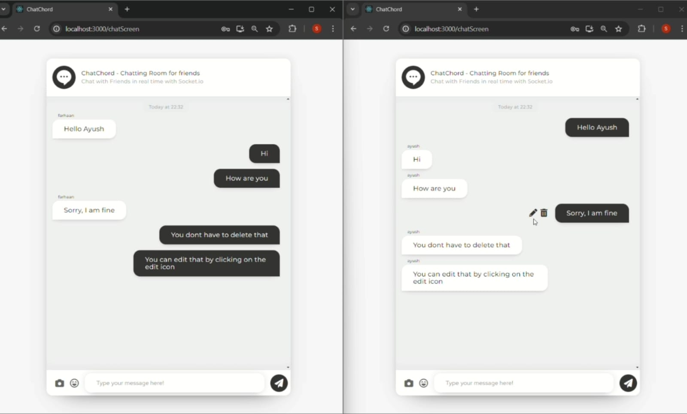

---

# 💬 ChatCord

## 📖 Description

ChatCord is a web application that allows users to chat in real-time. Built using the MERN stack, it supports all CRUD operations and utilizes Socket.IO for instantaneous message transfer between users.

## ✨ Features

- 📝 **Real-Time Messaging**: Instant message delivery using Socket.IO.
- 🔐 **User Authentication**: Secure user authentication with JWT.
- 🖋️ **CRUD Operations**: Full CRUD functionality using MERN Stack for messages and user authentication.

## 🚀 Installation

1. **Clone the repository**:
    ```bash
    git clone https://github.com/FSfarhaan/ChatCord.git
    cd chatcord
    ```

2. **Install dependencies**:
    ```bash
    # Install backend dependencies
    cd backend
    npm install

    # Install frontend dependencies
    cd ../frontend
    npm install
    ```

4. **Run the application**:
    ```bash
    # Start the backend server
    cd backend
    npm start

    # Start the frontend server
    cd ../frontend
    npm start
    ```

    Open [http://localhost:3000](http://localhost:3000) to view it in the browser.

## 🛠️ Usage

1. **Register or login to your account**.
3. **Enjoy real-time chatting with your friends**!

## 🧩 Code Overview

- **Frontend**: 
  - **React.js**: Handles the user interface.
- **Backend**: 
  - **Node.js and Express.js**: Manage the server and API endpoints.
- **Database**: 
  - **MongoDB**: Stores user data and messages.
- **Real-Time Communication**: 
  - **Socket.IO**: Manages real-time messaging.

## 🤝 Contributing

Contributions are welcome! Please create an issue or submit a pull request with your improvements.

## 📸 Screenshots

<!-- Add screenshots of your app here. Example: -->


## 📬 Contact

If you have any questions or suggestions, feel free to contact me at [farhaan8d@gmail.com](mailto:farhaan8d@gmail.com).
or connect me on https://www.linkedin.com/in/farhaan-shaikh-422301252/
---
